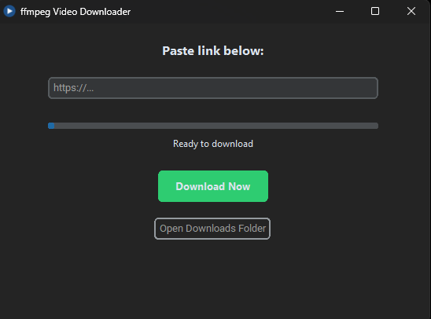

# ffmpeg Video Downloader
A GUI-based video downloader using yt-dlp and ffmpeg with automatic subtitle embedding.

## ⚖️ Comparison: Standalone vs. Extensions

| Feature | Browser Extensions | ffmpeg Video Downloader |
| :--- | :--- | :--- |
| **Privacy** | Can track browsing history | **100% Private / Local** |
| **FFmpeg Merging** | Usually requires extra install | **Fully Bundled** |
| **Subtitle Files** | Often hardcoded or ignored | **Embedded + Separate .srt** |
| **Speed/Limits** | Often restricted for free users | **Unlimited & Free** |
| **Site Support** | Varies by extension | **1000+ Sites (yt-dlp)** |
